# Coronavirus disease (COVID-19) outbreak

> I am a Chinese. The information here comes from the Chinese Internet. I only collect and translate it to share with you to avoid normal disasters

> 山川异域，风月同天。

> 同身共命，同气连枝。

>One body, one life, one breath.

>같은 몸과 함께 운명을 같이하여, 같은 기개가 끊이지 않는다.

>身を共にし命を共にする。

>I wish I were Superman and could save you guys :)  But now, Anyone is superman,Keep yourself safe. You're saving the planet

You can leave a message and ask questions. I will try my best to answer them

## Understand COVID-19

**Main symptoms**
People infected with the virus will have symptoms of varying degrees, some with fever or mild cough, some with pneumonia, some with even more serious or even death.
The lethality of the virus is about 2% to 4%, but this is a very early percentage that may change as more information is available. At the same time, this doesn't mean it's not serious, just that people infected with the virus don't have to face the most serious consequences.
**Route of transmission**
Novel coronavirus is the main way of transmission and respiratory droplet transmission and contact transmission, aerosol and fecal oral transmission route needs to be further clarified. According to the epidemiological investigation, the cases can be traced to the cases that have close contact with the confirmed cases.
- 1.Direct propagation
It refers to the infection caused by sneezing, coughing and speaking droplets of the patient, and the exhaled gas is inhaled directly in short distance;
- 2.aerosol transmission
It refers to the mixture of droplets in the air to form aerosol, which causes infection after inhalation;
- 3.Contact transmission
It refers to the droplets deposited on the surface of the object, after touching the contaminated hand, then touching the oral cavity, nasal cavity, eyes and other mucous membranes, leading to infection.

**Susceptible population**
People of all ages are likely to be infected, mainly adults, the elderly and the frail and sickly seem to be more likely to be infected. There is no evidence that pets such as dogs and cats can be infected.
The novel coronavirus is susceptible to pneumonia in children and pregnant women.

**reference:**
https://baike.baidu.com/item/2019%E6%96%B0%E5%9E%8B%E5%86%A0%E7%8A%B6%E7%97%85%E6%AF%92/24267858?fromtitle=%E6%96%B0%E5%86%A0%E7%97%85%E6%AF%92&fromid=24424810&fr=aladdin

## Is there a specific medicine?

NO,Other drugs can only reduce RNA replication,Other drugs can only reduce RNA replication, but they can't cure you 100%
## How do I prevent
1. Reserve N95 masks (the filtering effect of N95 masks is good). In the early stage of the epidemic, the number of people infected is large, and the concentration of virus is also large. N95 masks are relatively safe. You must wear masks every time you go out! You must wear masks! The probability of being infected without masks is very high!
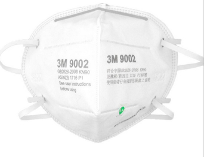
2. Store disinfectant, go home and disinfect the whole body (especially the sole, because the sole will step on phlegm, urine, etc.), and disinfect a series of frequently contacted things such as mobile phones, door handles, switches, etc

3. Reserve food! The food looting is not only in China, but also in Hong Kong, Singapore, Italy, South Korea and other countries and regions. The food reserve is enough for 1-2 months. Because the Chinese government forbids everyone to go out. (this reason is very complicated, but I think it is very effective and who also suggests it.)

## Core recommendations
1. Avoid contact with anyone, because you look at the person who feels healthy. He may have been infected a week ago, but he hasn't got sick yet. Of course, you should keep away from anyone who has a cough and fever. Although that's not very polite, if you are infected, you should know that you are responsible for the people near you. Otherwise, the virus will continue to spread because of your ignorance! This is reflected incisively and vividly in South Korea!
The safety of others is based on your safety. Please be responsible for yourself and the people around you! It's not about one person!
2. The most dangerous place: elevator lobby!
Avoid going to the elevator lobby if you want to! Wear goggles and mask, wash hands or disinfect after pressing the button

3. Avoid going to restaurants
4. Avoid going to the Office
5. Avoid toilets
If you want to go, please follow the advice below
Recommendation:
- 1. There are steps to go to the toilet, and they should be completed in order.
- 2. Before flushing the toilet, make sure to cover the toilet cover, so as to avoid the splashing of droplets carrying virus.
- 3. Before opening the exhaust fan of the toilet, it is necessary to open the doors and windows to avoid the formation of negative pressure backflow droplets in the sewage pipe or exhaust duct, otherwise, the virus droplets will not only invade the toilet, but also cause the virus to fill the whole toilet due to the closed space.
6. Disinfect the mobile phone
7. Wash hands frequently! Wash your hands frequently! Wash your hands frequently!
Recommendation:
- 1. Wash your hands as soon as you arrive
- 2. Wash your hands before eating
- 3. I've been to the elevator lobby and the high-risk area of the dining hall. I'll wash my hands when I come back
- 4. Wash your hands when you come back
- 5. Wash your hands before touching your face, especially your nostrils and eyes.

**reference:** 
https://c.m.163.com/news/a/F6GCI5P30550A3RU.html?spss=newsapp

## How do we get food? In China
In China, we have a lot of online shopping apps. During this period, they launched a door-to-door delivery service. We placed an order through the app, and then went to the gate of the community to get it, because the Chinese government does not allow us to leave the community, and no one else can enter the community.
## How do you work in China?
As long as it's not an important industry, such as mask industry and transportation industry, we all work online, communicate through social software, or email
##What is the purpose of 14 days of medical observation?
It is necessary to take strict medical observation and other preventive public health measures for close contacts, which is a responsible attitude to public health and safety, and also a common practice of the international community.
Referring to the other novel coronavirus cases, the coronavirus case information and the current prevention and control practice, the medical observation period of the close contacts was set to 14 days, and the close contacts were observed at home.
##How long can the new coronavirus survive without human body?
Virus is different from bacteria. It is a kind of microorganism without metabolism and replication function. Therefore, all viruses are easy to deform or inactivate after leaving the host.
According to the analysis of relevant data, the survival time of the new coronavirus in the dry and ventilated environment is less than 2 hours. However, the similarity between the new coronavirus and SARS is great. According to the survival time of the surface of SARS related in vitro articles, even if the community disinfection is in place, the virus may also survive in the handle, elevator, stairs and other places.
(in the confirmed case of Inner Mongolia, Bai, 40 years old, from Dalate County, Ordos City, lives on the upper floor of the confirmed case, song. He has no history of going out of the city, has no contact with fever patients, has not been to the farmer's market, and has no contact with wild animals. It was diagnosed on February 1. It can be seen from this case that the mode of transmission of the virus may not be limited to oral foam transmission, and the risk of contact transmission increases.)
##How to prevent novel coronavirus pneumonia
A. Cherish life and keep away from game;
B. If not necessary, do not go out, do not visit, home "self isolation"; do not go to many places, do not gather;
C. Keep hands clean. Wash your hands with alcohol containing hand sanitizer at home. Hand washing can defeat most viruses and bacteria;
D. When coughing or sneezing, cover the nose and mouth with disposable tissue or sleeve, and wash hands;
E. Cook meat, eggs and other foods thoroughly, disinfect the dishes and chopsticks with high temperature boiling water;
F. Avoid close contact with patients with respiratory tract infection;
G. Wear a mask, lucky star.

**reference:**
https://www.sohu.com/a/370439329_820625
## The difference of several kinds of masks
| Mask type  | PM2.5 concentration value before test  | PM2.5 concentration value after 30s |Filtering effect|Pic|
| :------------ |:---------------:| -----:|-----:|-----:|
| 3M mask (with breathing valve)    | 154 | 10.8 |93%|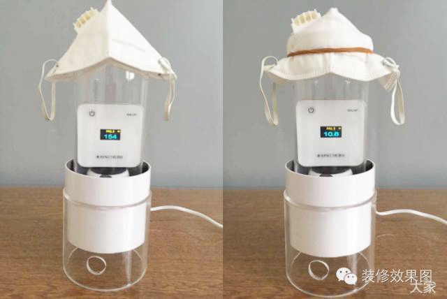|
| 3M mask (without breathing valve)      | 154  | 5.4 |96.5%| 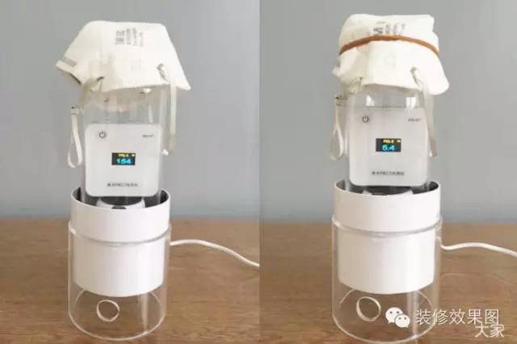|
| Cotton mask with strainer | 150 |   76.3 |49.1%|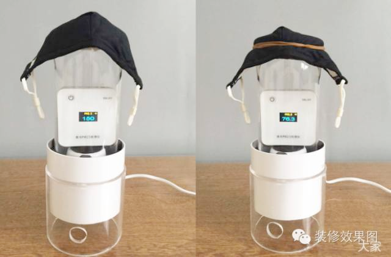|
| Thin disposable mask | 149 |   133 |10.70%| 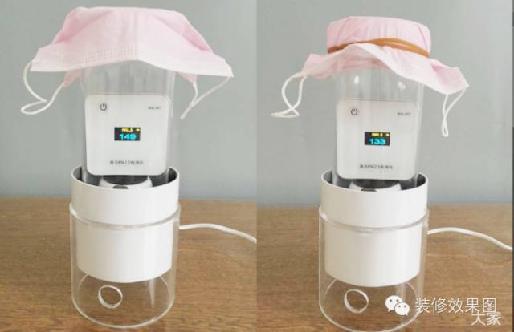|
| Disposable medical care mask | 152 |   80.4 |47.1%|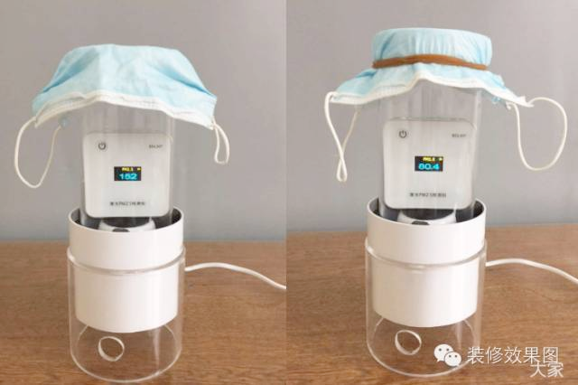|
| Cotton masks | 156 |   129 |17.3%|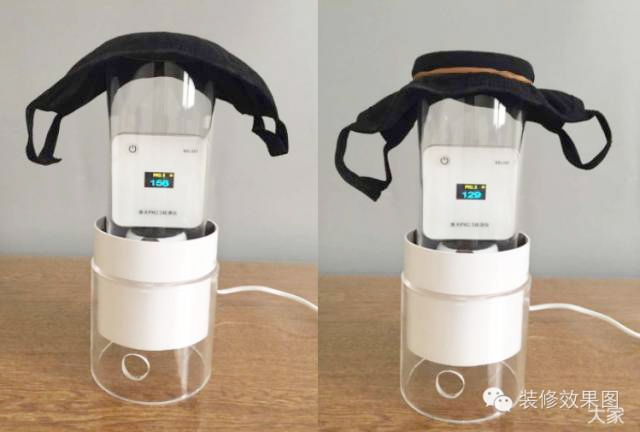|

N95 mask is recommended

## New coronavirus 16 Q 16 A

Important tips for epidemic prevention
One is the button, door handle, manual faucet and public telephone of the elevator. These places are the places where people contact frequently and frequently. They are the places where we need to disinfect.
Novel coronavirus is mainly respiratory tract, and two is air disinfection. If disinfectant is used to disinfect the air, it must be in an unmanned environment. Because if a person inhales disinfectant, or repeatedly sprays disinfectant on a person, there is a potential risk, and this risk cannot be quantitatively assessed, so it should be avoided as much as possible.
1. How long can the new coronavirus survive in the general environment?
A: the virus can only live in the cells of the organism, and it can hardly survive at room temperature.
2. Experts said that the virus was inactivated in 56 ℃ water for 30 minutes. Open water at 100 ℃, how long is it inactivated?
A: the virus only survives in animals, but not in vitro, so the articles do not need to be cooked.
3. How long can the virus survive when it leaves the human body on daily items such as doorknobs and mobile phones? If the virus leaves the living body, will the low temperature of minus 10 degrees in the North die?
A: the virus is not spread in the digestive tract. If you touch the doorknob or mobile phone, you can't pick your nose or your eyes. The virus can't survive without human body.
4. There are 84 disinfectants and alcohol at home. How can I use them?
A: 84 disinfectant and alcohol have killing effect on most bacteria and other microorganisms, but the virus can't survive without human body, so it's of little significance to use 84 disinfectant, alcohol and other disinfectants to wipe the ground.
5. Will this virus infect cats and dogs?
A: not found at present.
6. In addition to wearing masks when going out, should disposable gloves be worn?
A: no need. Wear gloves if you are afraid of cold. It's more important to wash your hands.
7. If you go out, can you wear more common medical masks sold by drugstores to improve the protection?
A: No. Outdoor activity single floor is enough.
8. How far is it safe to talk to strangers? If you don't talk to strangers, will passing by on the road infect you?
A: distance is one thing, but it's important not to sneeze or cough at people.
9. Can you eat raw vegetables? Like salads.
A: the new coronavirus is not transmitted through the digestive tract. You can eat salad.
10. Hardly go out, no cases have been found nearby. Can I wear ordinary disposable masks?
A: Yes.
11. Do you have any symptoms during the incubation period? Is incubation contagious?
A: the shortest is 1-2 days, the longest is 10-12 days, and the average is 7 days. The medical observation was 14 days. There is a certain infectivity in the incubation period. When the patient has high fever, it is the most infectious.
12. How is the symptom difference between new crown infection and common cold?
A: new crown infection mainly has fever, local respiratory symptoms are usually not serious, some people will have serious dyspnea or systemic damage. These are the biggest differences from the common cold.
13. Is there any specific medicine at present?
A: not yet. The treatment principle is mainly symptomatic and supportive.
14. What are the characteristics of those who can heal themselves? What are the characteristics of people who died of serious illness?
Answer: self-healing is related to physical fitness, mostly for people with sound immune function. Most of the patients who died of serious illness were old people and basic patients.
15. Is it possible to cure the discharged patients with secondary infection? How to care after recovery?
A: I don't think so at present, because there are antibodies. How to recover depends on the patient's recovery.
16. Are common cold drugs or antibiotics effective for the virus?
Answer: no effect.

**reference:** 
http://www.dgcio.com/nd.jsp?id=410

## Zhong Nanshan's latest answer to the new coronavirus!

A novel coronavirus was recently released in February 18th in Guangdong province to announce the latest progress in the treatment of new coronavirus. Zhong Nanshan, director of national respiratory disease clinical medicine research center and academician of Chinese Academy of engineering, attended the meeting. Zhong Nanshan said that at present, chloroquine phosphate recommended by experts is not a specific drug, but it has some help and is very worthy of discussion.
Academician Zhong Nanshan thought that the "plasma treatment" method which had been talked about before was relatively old, but it was more effective, more worthy of affirmation and safer. But at the same time, it should be noted that the source of plasma therapy is still limited.
For the mortality of 2019 ncov, Zhong Nanshan thinks that the mortality of 2019 ncov in the new coronavirus (SARS, mers and 2019 ncov) is relatively low.
Zhong Nanshan's latest answer to the new coronavirus!
1. Is chloroquine phosphate a specific drug?
Zhong Nanshan: if you want to ask if chloroquine phosphate is a specific drug, I don't think it's enough, but it's worth exploring. Chloroquine phosphate is effective against coronavirus, and it is used in human body this time.
Chloroquine phosphate is an old drug, which has no side effect in short term. It has been used in Beijing and Guangdong at the same time. Within 4-5 days, the virus has turned negative. Now, a large clinical observation is being carried out.
But whether it's a specific drug is not enough. It's helpful from the current situation.
2. How to treat unconventional cases? Is the current kit accurate?
Zhong Nanshan: about the incubation period. For example, we published 1099 articles, with an average incubation period of 4 days, and 2-7 days is the majority. But we also wrote faithfully for 0-24 days. 24 days was one in 1099. There are 13 cases over 14 days, and most of them also need to consider special circumstances. I don't think it's strange. There are always exceptions.
The method of nucleic acid test reagent itself is correct, but it depends on the material.
3. Fast kit problem?
Zhong Nanshan: Wuhan is the key. 80% of the patients are in Wuhan. It seems that Wuhan has not stopped human to human transmission. Now we need to solve two problems closely: how to separate normal people from patients and how to separate influenza virus from new coronavirus. If we always mix up, Wuhan has used a lot of human and financial resources, and this problem still cannot be solved.
So we strongly hope to strengthen the reagent, and we hope to distinguish the new crown or influenza soon. Now that the technology is available, the R &amp; D is available, we will wait for approval.
Supplementary information: Recently, under the guidance of academician Zhong Nanshan, a rapid test kit was developed. Only one drop of blood can be collected for 15 minutes to obtain the test results, and the positive bands can still be detected after the patient's plasma is diluted 500 to 1000 times.
4. The role of traditional Chinese medicine in new coronavirus?
Zhong Nanshan: Western Medicine found in the laboratory that cell level is effective for the new crown, but quite a lot of Western medicine is ineffective after entering the human body. Novel coronavirus pneumonia has been used in clinical treatment of new crown pneumonia. I am concerned about whether the use of Chinese medicine can reduce the virus entry into cells and reduce inflammation.
I attach great importance to the role of traditional Chinese medicine. Once there is evidence, traditional Chinese medicine can be used at ease. Especially in the early and middle stage.
5. How to evaluate the treatment of plasma in rehabilitation patients?
Zhong Nanshan: the plasma of convalescent patients was first used in China in 2005, when it was H5N1 infection. H5N1 had a high mortality rate, when miraculous viremia disappeared; by 2009, Hong Kong compatriots had done so, and it was found that there was a significant difference between the use of recovered patients' plasma and the non use.
As far as I know, I did this in Wuhan Institute of biological products. Some patients are very willing to contribute this blood, but the production process is still needed. Now we have done 10 cases, and 6 cases have gone viral after medication. Guangdong is also going to adopt this method, mainly for serious patients, not dying patients, which looks promising.
The old method is more effective, certain and safe. Sources are limited, but I think it's effective, especially for severe patients, not critically ill patients.
6. At present, severe patients and nosocomial infection are more concerned. What is the cure rate of severe patients in Guangdong, and what is the good experience to share?
Zhong Nanshan: about 85% of patients can be improved if they have good life support, treatment conditions and nutrition.
There are not many serious patients discharged from hospital, but 50% of them transferred from ICU to general ward. The effect of severe treatment is good.
The mortality rate of 2019-ncov is a little more than 2%. Among the three new coronaviruses (the first is SARS, the second is mers, and the third is 2019-ncov), the mortality rate of 2019-ncov is relatively low.
7. How to prevent nosocomial infection?
Zhong Nanshan: the problem of nosocomial infection is very important. Wuhan hospital is now very good, but it has become an important place for infection for some time before. At present, there are few medical people infected in other cities, because the protection is well done.
Sewers in toilets are usually of great importance. It's usually important to keep it. Like other foreign experts, I don't think it's an infection of the digestive tract. It's a dry stool. It's infected by air. This is the most reasonable explanation.

**reference**
http://tech.163.com/20/0218/18/F5MGR2VF000999D8.html

## Q &amp; A on mask making:
1. What should I do if there is a lack of some auxiliary materials or I feel that it is not easy to make them by hand?
A: the easiest way is to buy some or take out some of the ordinary masks that have been used before. After boiling water, cooking, disinfection and drying, cut a seam on the edge, and add the new melt blown non-woven filter layer, so that it can be reused as a new mask. (note that the melt blown non-woven fabric shall not be stained with water and can not withstand high temperature, otherwise the filter performance will be damaged.) If you really don't have a mask, please search the video website for mask making. I believe there must be a simple tutorial.
2. What are the most important filter materials?
A: N95 melt blown non-woven fabric is recommended first. This kind of fabric has a very fine fiber structure, which can well filter the particles in the air. If it is treated by electret, it will have electrostatic adsorption capacity and further enhance the particle filtration capacity.
If you can't buy the melt blown cloth, you can use the material with good hydrophobic performance but slightly larger structural aperture, such as polyester fiber, namely polyester. It can't achieve 95% filtering efficiency of the fusible spray cloth, but because it doesn't absorb water, it can also effectively protect the droplets after multi-layer folding.
Some friends mentioned SMS non-woven in their comments. This is a three in one material with two layers of spunbond and one layer of melt blown nonwovens. It has excellent filtration and liquid isolation performance and is often used as medical protective clothing. However, if it is to be used for making masks, it needs to have good air permeability and can not hinder normal breathing. The author didn't find out the standard of breath pressure or air permeability of SMS Nonwovens. It is suggested that friends purchase SMS non-woven fabrics carefully and invite professionals in the industry to answer questions.
3. How to disinfect the raw materials and made masks? Can the used masks be disinfected and reused?
A: it is feasible to disinfect and reuse the mask. However, please pay attention to two points: first of all, do not use alcohol, boiled water, steam or other high-temperature methods to disinfect the filter elements such as melt blown non-woven fabric or electrostatic filter cotton layer, because these methods will damage the physical structure of the material, make the filter layer variant, and greatly reduce the filtration efficiency; second, when disinfecting the used mask, pay attention to secondary pollution, keep the mask away from daily supplies, and do not Touch lips, eyes, etc. with the hand that has touched the mask.
Specific disinfection methods:
For non filter element structure, such as outer non-woven fabric, ear band, nose clip, etc. can be disinfected by boiling water cooking, alcohol soaking, etc.
For the melt blown non-woven filter layer, ultraviolet light (wavelength 254 nm, intensity 303uw / cm ^ 2, action for 30 seconds) or 70 ℃ oven can be used for 30 minutes. These two methods can kill bacteria and viruses without destroying the filter performance. For details, please refer to the question: can N95 mask be reused by spraying alcohol? 》Next @ Liang Chuan's answer.
4. Where can I buy materials?
A: This article was published on January 22. At that time, sales information of melt blown non-woven fabric can be found on Taobao, 1688 and other websites, and there are no cities or villages in all provinces.
Now most express delivery does not ship, we must ask when to ship before you buy. If you can't buy it, please refer to the second question and answer, and use some hydrophobic materials that can be seen everyday as an alternative.
Finally, the article and the author have nothing to do with all the material suppliers. The pictures in the article are only for illustration. If there are businesses or friends with supply channels, you are welcome to contact me by private mail. If it is verified to be effective, I will publish it for your convenience.
Thank you very much for taking the time to read. I hope it will help you. Finally, I wish the epidemic to end as soon as possible. All the people who are struggling in the front line, such as doctors, police and workers, will come back safely. Everyone from all over the world will be safe. Come on, Wuhan! Go China!

1. Introduction to antibacterial principle of medical mask
The masks that can play the role of virus protection are mainly medical surgical masks and N95 masks. According to the national YY 0469-2004 technical requirements for medical surgical masks, the important technical indicators that medical surgical masks must achieve include filtration efficiency, bacterial filtration efficiency (BFE) and respiratory resistance:
Filtration efficiency: under the condition of air flow (30 ± 2) l / min, the filtration efficiency of sodium chloride aerosol with aerodynamic median diameter of (0.24 ± 0.06) μ m shall not be less than 30%; Bacterial Filtration Efficiency: under the specified condition, the filtration efficiency of Staphylococcus aureus aerosol with average particle diameter of (3 ± 0.3) μ m shall not be less than 95%; respiratory resistance: under the condition of filtration efficiency flow, The inspiratory resistance shall not exceed 49pa, and the expiratory resistance shall not exceed 29.4pa.
The second is to ensure the filtration efficiency of bacteria. The filtration efficiency of Staphylococcus aureus bacterial aerosol (3 micron level) is not less than 95%. The novel coronavirus is a capsule coated, non segmented stranded single strand RNA virus with round or oval shape and a diameter of about 60-140nm (0.06~0.14 micron). Although the filtering efficiency of medical surgical mask is only 30% for 0.3 μ m particles, it can also provide effective virus protection because the virus, bacteria and other pathogens can not exist in the air in isolation and must be attached to dust, droplets and other micro clusters.
The filter efficiency of the medical protective mask with the executive standard of gb19083-2010 is the strictest among the medical masks. Level 1 is the same as N95, level 2 is the same as n99, and level 3 is the same as N100. (the filtration efficiency of 3 micron diameter aerosol in the air is not less than 95%, 99% and 99.97%, respectively. Thank you for your suggestions)
Therefore, although N95 mask is not a medical mask, its particle filtration efficiency meets the standard of no less than 95%, and it can better fit the human face, so it can also play a good role in virus prevention.
The main material that brings virus filtering effect to these two kinds of masks is the inner layer filter cloth with extremely fine and static electricity - melt blown non-woven fabric.
The main material of melt blown non-woven fabric is polypropylene, which is a kind of ultra-fine electrostatic fiber cloth and can catch dust. When the droplets containing pneumonia virus are close to the melt blown non-woven fabric, they will be electrostatic adsorbed on the surface of the non-woven fabric and cannot be penetrated. This is how the material insulates against germs. When the dust is caught by the superfine electrostatic fiber, it is not easy to be separated by cleaning, and water washing will also destroy the electrostatic dust collection ability. So the mask can only be used once. Suitable for flat face mask: ordinary grade, bfe95 (filter efficiency 95%), bfe99 (filter efficiency 99%), vfe95 (filter efficiency 99%), pfe95 (filter efficiency 99%), Kn90 (filter efficiency 90%).
2、 The manufacture of medical surgical mask
Medical surgical masks are generally made of three layers of non-woven fabric. The material is spunbond + melt blown + spunbond. One layer of staple fiber can also be used to improve the skin touch, that is, ES hot-rolled non-woven fabric + melt blown non-woven fabric + spunbond non-woven fabric. The outer layer of the mask is designed to prevent flying foam, filter in the middle layer and absorb moisture in the memory. Generally, 20 g melt blown cloth is used.
The N95 cup mask is composed of needled cotton, melt blown cloth and non-woven cloth. The melt blown cloth usually weighs 40g or more, plus the thickness of needled cotton, so it looks thicker than the flat mask in appearance, and its protective effect can reach at least 95%.
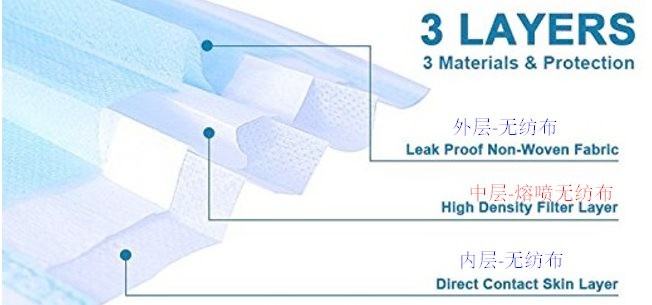
Purchase of raw materials:
The most important N95 melt blown non-woven fabric has a purchase channel on taobao.com, with a unit price of 68 yuan per barrel;
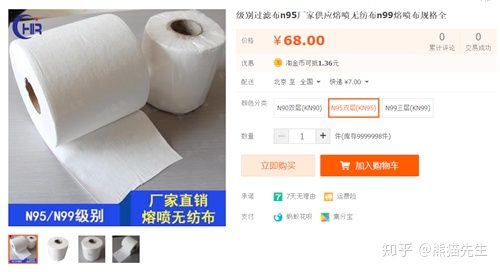
2. It is recommended to use needled cotton as the outer material to prevent the finished respirator from being too suffocating and harmful to breathing. Needled cotton is also called polyester needled felt. This product has the advantages of high porosity, good permeability, high dust collection efficiency and long service life of common felt filter cloth. Taobao can buy;
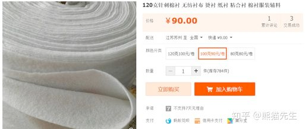
3. Hot rolled non-woven fabric or medical gauze is recommended for the inner layer material, which can improve the comfort;
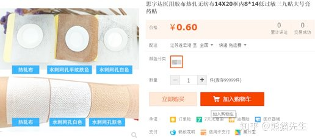
4. To further improve the fit. You can buy plastic nasal splint to stick to the inner layer of the mask. When using, soak it in hot water of 70 or 80 degrees, take it out after it is soft and fit it on the nose for shaping;
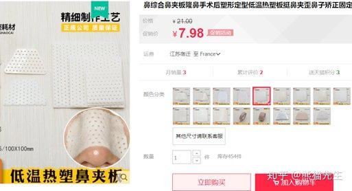
5. Ear belt, ordinary cloth belt is OK;
6. Use strong glue or needle thread to glue or sew the three-layer materials of the mask together along the edge, and fix the ear belt on both sides of the mask.
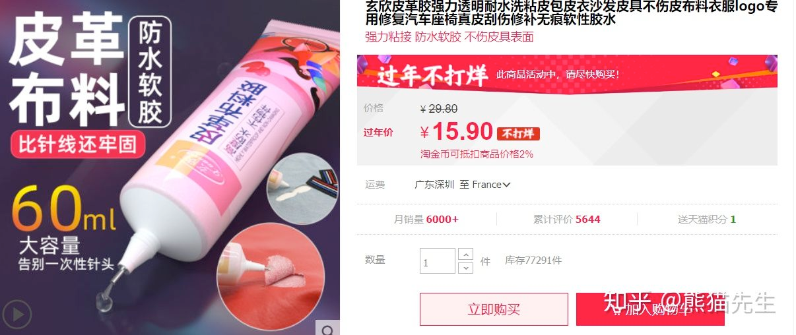
The specific production needs to give full play to your manual skills. I hope this article can help you a little. Ample food and clothing by working with our own hands. At the same time, the author always believes that the most important thing in a crisis period is to keep calm and not panic. Do a good job in peacetime protection, pay attention to personal hygiene, improve their own resistance. We have a strong social organization ability, as well as serious, professional and not afraid of sacrifice of medical staff, will be able to control the infection.

**reference**
https://zhuanlan.zhihu.com/p/103819650